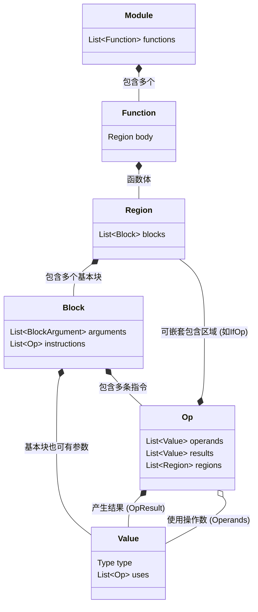

之前的 sysy 编译器是采用的 yacc + bison （前端解析 AST），遍历 AST 生成 koopa ir， 然后借助 koopa 的 runtime 解析 ir 成易于遍历的形式，接下来再遍历这个生成 riscv。

这个过程比较简单，可以优化的阶段在 koopa ir 和最终生成 riscv。

让我想想之前的缺陷有哪些。

一是没有浮点数计算系统。

二是 koopa ir 不是 SSA 形式。

三是在二基础上，没有 SSA 和数据流分析，我们就不好对 ir 进行优化，生成的 riscv 就很慢。

按照优先级排序，我们对 ir 要做的优化依次是：

1. 构建 CFG 和支配树 
2. mem2reg，将栈上的 alloc/load/store 转化为 SSA 的寄存器操作和 phi 函数。
3. 寄存器分配算法（图着色？）没有仔细了解。
4. 死代码消除 DCE。数据分析，这个优化应该比较好做。
5. 常量折叠与传播。这个也很好写
6. 公共子表达式消除。
7. 窥孔优化。听说比较复杂，针对目标机器指令进行优化。
8. 循环不变量外提。涉及到复杂理论，比较复杂。
9. 循环展开。同理。

在总决赛，支持 simd ，使用并行计算加速。


先留几个问题，之前的架构要不要调整？测试采用什么形式？日志是自己写还是用日志库？如何平衡比赛和 AI 的使用？

shiroboko p16 13:10 

## 结构化 ir

已经确定 ir 采用 mlir 类似的设计。使用结构化控制流。工作量也许有点大。但是时间肯定是够的



想想 ir 应该怎么设计。

sysy 的 EBNF 形式

展示语句

```
int a = 1;
```

在线性 ir 里是：

```
%a = 1
```

我们主要有

局部变量，全局变量，常量，循环语句，条件变量。

标量，向量。

数组（聚合类型），指针。

i32， float，int [] 和将来决赛里的 vec，vec 是什么？动态数据 lva？·。

对于结构化 ir， 我们需要保留循环结构，条件结构，这样易于做数据流分析。

在一个 scope 里面，我们以 field 结尾？我记得在 koopa ir 里面有一个 basic block 的概念，可以简单的理解为一个 {} 里面的作用域。当然，是嵌套递归的。

### 什么是 module？

在 ir 中，module 对应着最顶层的逻辑单元，和 tu 的概念是类似的。

但是在我们的编译器中，我们需要 tu 这种概念吗？我们需要处理链接，装载吗？

在一个标准的 module 中，通常包含四个部分。元数据，全局变量，函数，符号表。

### 什么是 function？

函数由函数名，参数列表，返回值类型以及嵌套的 region 组成。函数是逻辑执行的最小单元。

### 什么是 region？

在线性 ir （平坦化 ir）中，if 和 while 是通过 label 和 goto 连接成的，但在结构化 ir 中，我们保留了 if 和 while 的层次信息。

举个栗子，在 if 中，我们有两个 region，一个 if region ，一个 else region。

region 保留了源代码的嵌套信息，方便进行高级优化，可以说结构化 ir 最重要的特征也不为过。

### 什么是 basic block？

一个基本块是一系列连续执行的指令，中间没有跳转点。

### 什么是 operation/instruction？

是 ir 的最小单位，由四个部分构成：

- opcode：如 add， load， store 等
- operands：指令处理的数据，比如 %8, %9
- attributes：额外的元数据，比如 dims
- types：每个数据的类型，确定其字节大小

总结一下， 我们的结构化 ir 大概如这种形式：

```
Module {                                     ; 1. 顶层容器
  GlobalVariables...
  
  Function @name(%arg0) {                    ; 2. 函数
    Block {                                  ; 4. 顶级块
      %0 = constant 1                        ; 5. 指令
      
      If (%cond) {                           ; 3. 区域 (Region) 开始
        Yield %0                             ; 5. 终止指令
      } Else {
        Yield %arg0
      }
    }
  }
}
```

接下来，正式设计我们的 ir。

## 数组

这些大体都是一样的 ，考虑如何设计 function，array，pointer 吧。

数组，数组有定义，访问，写入。

关于定义时是否使用常量来进行计算，我觉得统一使用赋值后的临时值来进行计算。

重新设计咯，我们明确一下数组的语义。。。

`i32[2][3]` 是一个对象类型，它代表着内存中连续的 6 个整数。占用 24 bytes。

`i32[2][3]*` 是一个指针类型，它储存一个地址，这个地址指向一个 `i32[2][3]` 类型的对象，内存占用 8 字节。

`i32[3]*` 是一个指针类型，它指向一个包含三个整数的数组。

所以，在给数组分配内存时，就这么写：

```mlir
%arr = alloca : i32[2][3] -> i32[2][3]*
```

接下来我们再考虑一个问题，当加载数组的时候，比如 `int a = arr[1][2];` 那我们的 ir 怎么写呢？

```
%a = load %arr[%1][%2] : i32[1][2]* -> i32
```

这样吗，这样确实符合我们的统一形式，但是语义如何理解呢？

这个时候， `[][]` 代表什么？我们设定它为索引，也就是说 `%arr[%1][%2]`  的意思是，以 `%arr` 这个指针为起始点，偏移 `[%1][%2]` 的地址，然后 load 指令从这个地址加载出一个 i32 的值。

我还是觉得很别扭，如果吧 `[][]` 当作索引，根据我们 : input -> output 的语义，这个 `%arr[%1][%2]` 的类型是 `i32[2][3]*`，但是 `i32[2][3]*` 应该是一个指向 `i32[2][3]` 的指针。这样语义就不匹配了。    

不如我们换一种形式，load 指令在加载数组的时候，形式拓展一下。

```mlir
// 稍微加个空格就好很多
%a = load %arr [%1][%2] : i32[2][3]* -> i32 

// 或者这样 %a = load %arr < %1, %2 > : i32[2][3]* -> i32
// 或者这样 %a = load %arr(%1)(%2) : i32[2][3]* -> i32
```

这样语义就很明确了。

接下来一个麻烦的东西是数组退化。。。store 倒是简单，和 load 一体两面。

不赖，哈基米指出我既然引入了 getptr，完全可以使用 getptr 来降低 load store 的复杂度，所以我们上面的语句：

```mlir
%a = load %arr [%1][%2] : i32[2][3]* -> i32
```

可以拆成两步：

```mlir
%ptr = getptr %arr, %1, %2 : i32[2][3]* -> i32*

%a = load %ptr, i32* -> i32
store %a, %ptr : i32, i32*
```

这样设计确实会清爽很多。

数组退化主要是函数传参要处理。。加一个新指令吧

```mlir
; &a[i][0]
%ptr = getptr %arr [%i] : i32[2][3]* -> i32[3]*

call @func(%ptr) : (i32[3]*) -> void
```

假设代码：

```c
void func(int b[][3]) {
    int x = b[1][2];
}
int main() {
    int a[2][3];
    func(a);
}
```

对应的 IR 设计：

```mlir
func @func(%arg_b) : (i32[3]*) -> void {
  %1 = 1
  %2 = 2
  %ptr = getptr %arg_b, %1, %2 : i32[3]* -> i32*
  %x = load %ptr : i32* -> i32
  ret
}

func @main() {
  %a = alloca : i32[2][3] -> i32[2][3]*
  
  ; 数组退化：获取 a[0] 的地址传递给函数
  %0 = 0
  %ptr = getptr %a [%0] : i32[2][3]* -> i32[3]*
  
  call @func(%ptr) : (i32[3]*) -> void
  ret 0
}
```


| 指令         | 接口示例                                          | 语义说明           |
| :--------- | :-------------------------------------------- | :------------- |
| **alloca** | `%p = alloca : i32[2][3] -> i32[2][3]*`       | 分配空间，返回对象指针。   |
| **load**   | `%v = load %p : i32* -> i32`                  | **取值**。        |
| **store**  | `store %v, %p : i32, i32*`                    | **存值**。        |
| **getptr** | `%p2 = getptr %p, %i : i32[2][3]* -> i32[3]*` | **仅寻址**，不访问内存。 |


数组就这样了，现在这个麻烦的东西搞定了，再来看看简单的吧。

## 操作指令

先设计操作指令如何？

当float 类型的值隐式转换为整型时，例如通过赋值int i = 4.0; 小数部分将被 丢弃；如果整数部分的值不在整型的表示范围，则其行为是未定义的； 

当int 类型的值转换为float 型时，例如通过赋值float j = 3; 则转换后的值保
持不变。  

注：编译器在实现隐式类型转换时，需要结合硬件体系结构提供的类型转换指令 或运行时的 ABI（应用二进制接口）。例如，对于 ARM 架构，可以调用运行时 ABI 函数`float __aeabi_i2f(int)` 来将int 转换为float。  

参见 https://developer.arm.com/documentation/ihi0043/latest

对了，根据前辈们的经验，要注意内存对齐。

关于整形和浮点型，我们 KISS 一点，赋值的时候只需要 `%0 = 1` 和 `%0 = 1.0f` 即可。

我们统一一下 `: input -> output` 这样设计。然后统一 `-> output` 这样方便写代码和解析。

### 算术运算符

| 指令       | 示例                        |
| :------- | :------------------------ |
| **add**  | `%3 = add %1, %2 -> i32`  |
| **sub**  | `%3 = sub %1, %2 -> i32`  |
| **mul**  | `%3 = mul %1, %2 -> i32`  |
| **div**  | `%3 = div %1, %2 -> i32`  |
| **mod**  | `%3 = mod %1, %2 -> i32`  |
| **fadd** | `%3 = fadd %1, %2 -> f32` |
| **fsub** | `%3 = fsub %1, %2 -> f32` |
| **fmul** | `%3 = fmul %1, %2 -> f32` |
| **fdiv** | `%3 = fdiv %1, %2 -> f32` |

除此之外，我们还需要考虑浮点数和整数之间的相互转化。

| 转化            | 示例                         |
| ------------- | -------------------------- |
| $i32 \to f32$ | `%2 = i2f %1 : i32 -> f32` |
| $f32 \to i32$ | `%2 = f2i %1 : f32 -> i32` |
| **zext**      | `%3 = zext %1 : i1 -> i32` |

### 比较运算符

格式：`%res = op %a, %b : i32 -> i1`

`i1` 可以理解成 bool 类型，设计这个的原因是方便进行编译优化，如果是 `int` 类型，在判断 cond 语句时，我们需要一个多余的临时值来装载 `op` 的结果，如果使用 `i1`，我们就可以直接一比一的映射到汇编当中，而且我们无法假设 `op` 的后的 `res` 是 `bool`。比如这种代码 `int c = (a < b) & 1`。

当然，我们可以在 lowering 的过程中，对这些冗余写法进行优化（high ir -> mid ir），但是从设计层面解决问题往往更加轻松舒适。

| 指令     | 含义               | 接口示例                         |
| :----- | :--------------- | :--------------------------- |
| **eq** | Equal            | `%3 = eq %1, %2 : i32 -> i1` |
| **ne** | Not Equal        | `%3 = ne %1, %2 : i32 -> i1` |
| **lt** | Less Than        | `%3 = lt %1, %2 : i32 -> i1` |
| **gt** | Greater Than     | `%3 = gt %1, %2 : i32 -> i1` |
| **le** | Less or Equal    | `%3 = le %1, %2 : i32 -> i1` |
| **ge** | Greater or Equal | `%3 = ge %1, %2 : i32 -> i1` |

除了这些，同时有对应的 `float` 比较就行了。

这里要更加复杂一些，浮点和整数比较怎么计算的呢？我还不知道 sysy 支不支持整数浮点数比较，但是既然可以隐式转化的话，进行比较也不是不行。这样的话，我们先进行类型转化，`int -> float` 然后进行单类型之间的比较。

### 逻辑运算符

在 SysY 中，逻辑运算（如 `&&`, `||`）在前端通常处理为短路跳转，但在 IR 层级，对于非短路的逻辑或位运算，我们需要以下指令：

| 指令      | 含义  | 接口示例                     |
| :------ | :-- | :----------------------- |
| **and** | 与   | `%3 = and %1, %2 -> i32` |
| **or**  | 或   | `%3 = or %1, %2 -> i32`  |
| **xor** | 异或  | `%3 = xor %1, %2 -> i32` |
| **shl** | 左移  | `%3 = shl %1, %2 -> i32` |
| **shr** | 右移  | `%3 = shr %1, %2 -> i32` |

sysy 中短路不会出现在 `if/while` 外面，比如 `int a = f() && g();`

### 内存与控制流指令

想了一下，我们还是统一一下接口比较合理。

| 指令         | 接口示例                                         | 说明                                   |
| :--------- | :------------------------------------------- | :----------------------------------- |
| **load**   | `%x = load %ptr : i32* -> i32`               | 加载 i32* 返回 i32                       |
| **store**  | `store %val, %ptr : i32, i32*`               | store 同其他指令不同，返回是 void，所以我们用 `,` 标记。 |
| **ret**    | `ret %val`                                   | 从函数返回一个值。                            |
| **ret**    | `ret`                                        | 无返回值返回 (void)。                       |
| **alloca** | `%ptr = alloca : i32 -> i32*`                | 输入 i32 返回 i32*                       |
| **call**   | `%res = call @func(%args) : (types) -> type` |                                      |
| **call**   | `%res = call @func(%args) : (types)`         | 函数返回值为空                              |

我们不需要在 alloca 中保留对齐信息，这个我们放到 mid ir 来处理。

假设有 SysY 代码：`int a = 1; if (a < 1.5)`

对应的 IR 设计：

```mlir
%a_ptr = alloca -> i32
store 1, %a_ptr : i32, i32*

%0 = load %a_ptr : i32* -> i32
%1 = i2f %0 : i32 -> f32        ; 隐式转换：int -> float
%2 = 1.5f
%3 = lt %1, %2 : f32 -> i1      ; 浮点比较

if %3 {
  ; then 区域
} {
  ; else 区域
}
```

假设有 SysY 代码：`int c = (a << 1) | b;`

```mlir
%a = load %a_ptr : i32* -> i32
%1 = 1
%2 = shl %a, %1 -> i32           ; 左移
%b = load %b_ptr : i32* -> i32
%3 = or %2, %b -> i32            ; 位或
store %3, %c_ptr : i32, i32*
```

## control flow

我们在 high ir 中不需要 bb，基于 SSA 的优化我们留到 mid ir 中再做。

### if & else

```mlir
if %cond {
  yield
} {
  yield
}
```

### while

```mlir
while {
  ; condition assessment area
  %a = load %a_ptr : i32* -> i32
  %b = 10
  %cond = lt %a, %b : i32 -> i1
  condition(%cond)
} {
  %val = load %ptr_a : i32* -> i32
  %new = add %val, 1 -> i32
  store %new, %ptr_a : i32, i32*
  yield 
}
```

不过我们不打算支持三目运算符，就没有这种 `yield (%val)` 的语句了。

然后明确一下 break 和 continue 的语义。

break 是在循环中立马停止当前的 body region，break 后，control flow 跳转到 while 指令的下一条指令。查询方式嘛，压栈出栈就行。

continue 是在立马终止循环，跳转到循环的 condition region 进行 judge。

```mlir
while {
  %c = load %cond_ptr = i1* -> i1
  condition(%c)
} {
  %val = load %x : i32* -> i32
  %is_zero = eq %val, 0 : i32 -> i1
  
  if %is_zero {
    break
  } {
    yield
  }
  
  %new = sub %val, 1 -> i32
  store %n32, %x : i32, i32*
  yield
}
```

不过这种语句就不如线性 ir 好处理了：

```
if (a && b) { if_body } else { else_body }
```

由于结构化 ir 得保留结构信息，而 `&&` 得短路求值，所以在 if region 中得嵌套一个 else，这个 else region 的内容和外层 else region 的内容是一样的。

如果是线性 ir 的话，一个 goto 就行了，这个要怎么处理比较好呢？

### scope

还有一种情况需要考虑：

```c
int main () {
  int a;
  {
    a = 1;
  }
  return a;
}
```

在线性 ir 中，我们用 scope + bb 管理这种情况。想了想，直接拍平，在 mid ir 进行生命周期分析可以处理其 side effect。

对重复变量重命名，用符号表管理即可。

## 全局变量和初始化

保持指令前后语义一致性。

`@name = global init_val : type`

比如 `@g_a = global 10 : i32` `@g_b = global 3.14f : f32`

我们统一所有的指令都为 :

```
[Target] [=] [Opcode] [Operands] [:] [OperandsTypes] [->] [TargetTypes]
```

最后，再引入 `zeroinit` 关键字，防止 ir 初始化过长。。。似乎还是数组的问题。。。

```mlir
@a = global {{1, 2}, {3, 4}} : i32[2][2]

@a = global {1, 2, zeroinit} : i32[4]
```

还需要注意全局变量都是指针。

## 函数调用和符号管理


函数定义如下：

```
func @foo(%args) : (i32) -> void

func @add(%a, %b) : (i32, i32) -> i32
```

规定位于 global 的 ident 采用 `@`，位于 local 的 ident 采用 `%`。在 mid ir 中，bb 采用 `^` 。

函数调用如下：

```
call @add(%1, %2) : (i32, i32) -> i32
```

忘记写函数声明了，函数声明和 call 形式是一样的，没啥问题：

```
decl @add() : (i32, i32) -> i32
```


我们这样设计 ir 的话，在实现上可以复用很多代码，而且很多代码的逻辑是一样的，设计类也很方便，而且利于优化，感觉非常不错！